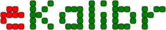

    

---

<h3 align="center">eKalibr: Event-Based Visual Calibration Framework</h3>

    <a href="https://github.com/Unsigned-Long"><strong>Author » Shuolong Chen</strong></a>

---

    <a><strong>Version 1.0.0 » eKalibr: Event-Based Visual Calibration Framework</strong></a>

`eKalibr` is a visual calibration framework for event cameras, inspired by the well-known frame-based calibration framework `Kalibr`. `eKalibr` has the following features:

+ Calibration using a circular grid pattern. `eKalibr` includes a precise circular grid pattern recognition pipeline, capable of directly extracting patterns from raw event streams.
+ It is open-source and free of charge. Any organization, as long as it complies with the `eKalibr` open-source license, can freely use `eKalibr` for secondary development without restrictions.
+ Currently, `eKalibr` supports intrinsic calibration of event cameras. In the future, I will extend `eKalibr` to support multi-event-camera and event-IMU (event-inertial) spatiotemporal calibration. Stay tuned!

We are also excited to announce the release of the **official eKalibr Docker image**! To make it easier for users to use the `eKalibr` project, we have built and published a `Docker` image that simplifies the setup process. With this `Docker` image, you can now easily run `eKalibr` in an isolated environment without worrying about dependency issues or complex configurations. For more details, please see [here](./build_ekalibr_docker.md).

    <a><strong>Version 2.0.0 » eKalibr-Stereo: Spatiotemporal Calibration for Multiple Event Cameras</strong></a>

`eKalibr-Stereo` is a spatiotemporal calibrator orienting event-based multi-camera systems. `eKalibr-Stereo` has the following features:

+ `eKalibr-Stereo`  supports spatial (extrinsics) and temporal (time offsets) calibration, and is based on continuous-time methods, with outstanding calibration accuracy. `eKalibr-Stereo` has been integrated into the original `eKalibr` repository and can be used directly by downloading it.
+ An additional motion-prior-aided tracking module for incomplete grid pattern identification is designed in `eKalibr-Stereo`, to maximize the continuity of pattern tracking, facilitating the spatiotemporal optimization.
+ It is open-source and free of charge. Any organization, as long as it complies with the `eKalibr-Stereo` open-source license, can freely use `eKalibr-Stereo` for secondary development without restrictions.
