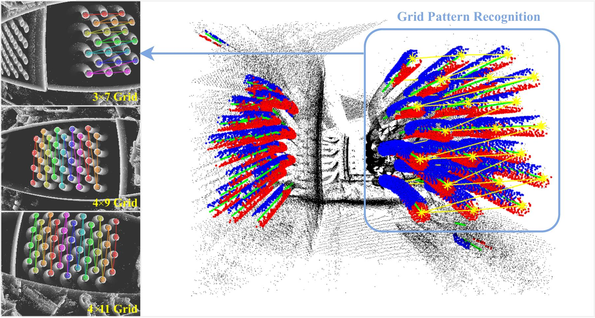
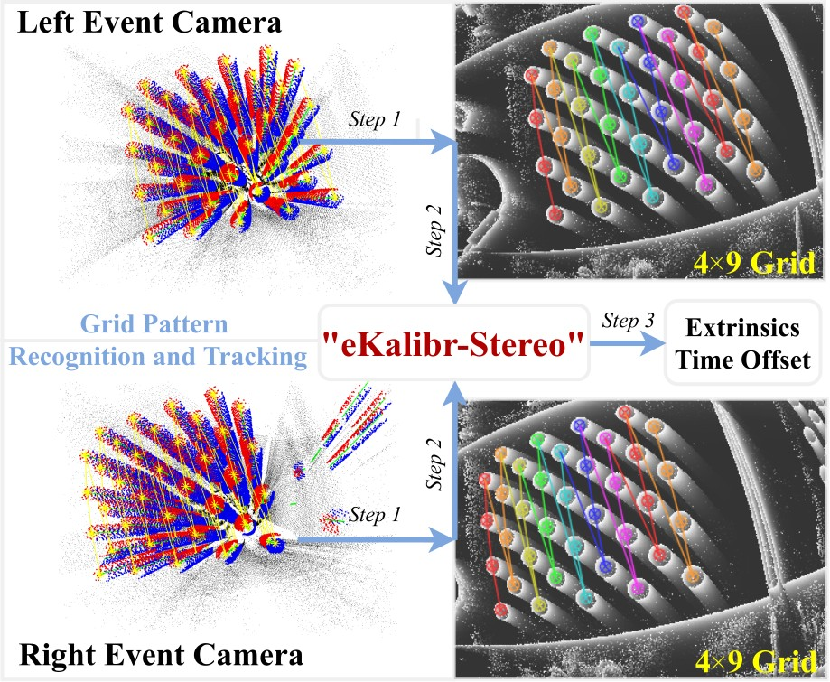

<div style="text-align: center;">
    
</div>

---

<h3 align="center">eKalibr: Event-Based Visual and Visual-Inertial Calibration Framework</h3>
<p align="center">
    <a href="https://github.com/Unsigned-Long"><strong>Author » Shuolong Chen</strong></a>
</p>
<p align="center"><i>"The naming of <strong>eKalibr</strong> is inspired by <a href="https://github.com/ethz-asl/kalibr.git">Kalibr</a>, but not an extension of it."</i></p>
<p align="center">
    :tada: <a href="./docs/details/news.md"><i><strong>News »</strong> eKalibr Version 3.0.0 Is Released! Support Intrinsic, Extrinsic, Time Offset Calibration!</i></a>
</p>


---

`eKalibr` is a visual calibration framework for event cameras, inspired by the well-known frame-based calibration framework `Kalibr`. `eKalibr` has the following features:

+ Calibration using a circular grid pattern. `eKalibr` includes a precise circular grid pattern recognition pipeline, capable of directly extracting patterns from raw event streams.
+ It is open-source and free of charge. Any organization, as long as it complies with the `eKalibr` open-source license, can freely use `eKalibr` for secondary development without restrictions.
+ Currently, `eKalibr` supports ***<u>intrinsic calibration</u>***, ***<u>spatiotemporal calibration</u>*** (extrinsic and time offset) for multiple event cameras and event-inertial sensor suites.

For more details, please refer to our article :point_down::

+ **S. Chen**, X. Li*, L. Yuan and Z. Liu, "eKalibr: Dynamic Intrinsic Calibration for Event Cameras From First Principles of Events," in IEEE Robotics and Automation Letters (RA-L), 2025. [[paper-ral](https://ieeexplore.ieee.org/document/11012137)] [[paper-arXiv](https://arxiv.org/abs/2501.05688)] [[video](https://www.bilibili.com/video/BV1yKc1e8Edc)] [[code](https://github.com/Unsigned-Long/eKalibr.git)]
+ **S. Chen**, X. Li*, and L. Yuan. eKalibr-Stereo: Continuous-Time Spatiotemporal Calibration for  Event-Based Stereo Visual Systems[J]. arXiv preprint arXiv:2504.04451, 2025. [[paper-ral](https://ieeexplore.ieee.org/document/11155126)] [[paper-arXiv](https://arxiv.org/abs/2504.04451)] [[video](https://www.bilibili.com/video/BV1LEu2zFE4X)] [[code](https://github.com/Unsigned-Long/eKalibr.git)]
+ **S. Chen**, X. Li*, and L. Yuan. eKalibr-Inertial: Continuous-Time Spatiotemporal Calibration for  Event-Based Visual-Inertial Systems[J]. arXiv preprint arXiv:2509.05923, 2025. [[paper-arXiv](https://arxiv.org/abs/2509.05923)] [[code](https://github.com/Unsigned-Long/eKalibr.git)]


---

<p align="middle">
    <a href="https://www.bilibili.com/video/BV1yKc1e8Edc"><strong>« The Video of eKalibr »</strong></a>&nbsp;&nbsp;&nbsp;&nbsp;&nbsp;&nbsp;
    <a href="https://www.bilibili.com/video/BV1LEu2zFE4X"><strong>« The Video of eKalibr-Stereo »</strong></a>
</p> 
<p align="center"><i>"Event-Based, Intrinsic, Spatial, Temporal, Multiple, Easy To Use, You Only Calibrate Once"</i></p>

---

<div align=center></div>

---


<p align="left"><strong>Tutorial: Prepare eKalibr for Calibration »</strong></a>
</p> 


`eKalibr` has been tested only on `Ubuntu 20.04`. Generally, the key dependencies are `ROS1` and `CPP17`. If both of these requirements are met, there should be no issues. To use `eKalibr`, please first follow [tutorial](docs/details/build_ekalibr.md) (*install from **source***) or [tutorial](docs/details/build_ekalibr_docker.md) (*install using **docker***) to configure the necessary environment and compile `eKalibr`, and then proceed with [tutorial](docs/details/use_ekalibr.md) for specific data collection and sensor calibration.


<p align="left"><strong>Access Public Datasets of eKalibr »</strong></a>
</p> 

To facilitate the learning of those interested in `eKalibr`, we have made the datasets used for testing and evaluating `eKalibr` publicly available:

+ Intrinsic calibration datasets of event cameras. These datasets can be accessed [here](https://huggingface.co/datasets/ULong2/eKalibr-Dataset/tree/main/intrinsics).
+ multi-camera (e.g., stereo camera) calibration datasets for event cameras. These datasets can be accessed [here](https://huggingface.co/datasets/ULong2/eKalibr-Dataset/tree/main/multi-camera).
+ visual-inertial calibration dataset for event-IMU systems. These datasets can be accessed [here](https://huggingface.co/datasets/ULong2/eKalibr-Dataset/tree/main/visual-inertial).


---

<h5 align="center">Copyright</h5>

---

```cpp
MIT License

Copyright 2025, the School of Geodesy and Geomatics (SGG), Wuhan University, China

eKalibr: Event-Based Visual Calibration Framework
 GitHub: https://github.com/Unsigned-Long/eKalibr.git
 Author: Shuolong Chen (shlchen@whu.edu.cn)
  ORCID: 0000-0002-5283-9057

Permission is hereby granted, free of charge, to any person obtaining a copy
of this software and associated documentation files (the "Software"), to deal
in the Software without restriction, including without limitation the rights
to use, copy, modify, merge, publish, distribute, sublicense, and/or sell
copies of the Software, and to permit persons to whom the Software is
furnished to do so, subject to the following conditions:

The above copyright notice and this permission notice shall be included in all
copies or substantial portions of the Software.

THE SOFTWARE IS PROVIDED "AS IS", WITHOUT WARRANTY OF ANY KIND, EXPRESS OR
IMPLIED, INCLUDING BUT NOT LIMITED TO THE WARRANTIES OF MERCHANTABILITY,
FITNESS FOR A PARTICULAR PURPOSE AND NONINFRINGEMENT. IN NO EVENT SHALL THE
AUTHORS OR COPYRIGHT HOLDERS BE LIABLE FOR ANY CLAIM, DAMAGES OR OTHER
LIABILITY, WHETHER IN AN ACTION OF CONTRACT, TORT OR OTHERWISE, ARISING FROM,
OUT OF OR IN CONNECTION WITH THE SOFTWARE OR THE USE OR OTHER DEALINGS IN THE
SOFTWARE.
```

libr
